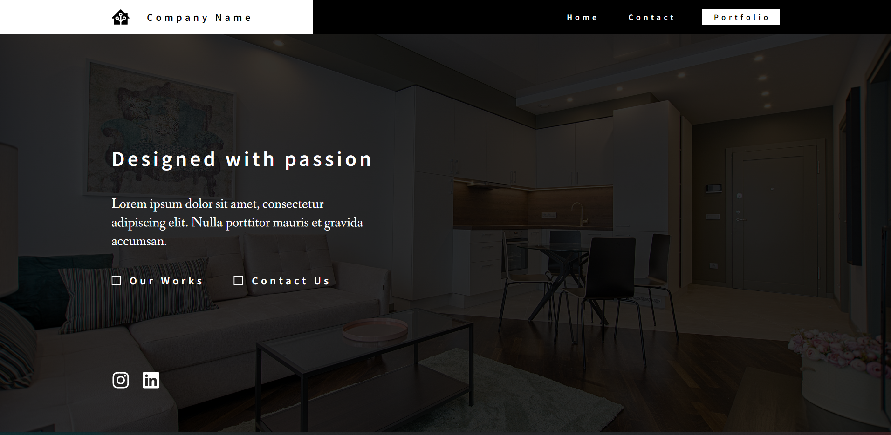

# Interior Design Portfolio Web using ReactJS and ExpressJS

> Web app portofolio berbasis NodeJS dengan framework ReactJS dan ExpressJS.



## Table of Contents
* [General Info](#general-information)
* [Setup](#setup)
* [Getting Started](#getting-started)
* [Usage](#usage)
* [Project Status](#project-status)
* [Room for Improvement](#room-for-improvement)
* [Contact](#contact)

## General Information
Aplikasi bekerja dengan melakukan iterasi pada setiap folder di dalam direktori project untuk mencari semua projek yang ada dan deskripsinya.


## Setup / Pre-requisite
- NodeJS

## Getting Started
Cara untuk melakukan configurasi terhadap portofolio

> Cara modifikasi Portofolio
- Buka Folder public/project/portfolios/
- Atur tahun-tahun portofolio dengan membuat folder tahun
- Atur project-project portofolio dengan membuat folder project di dalam folder tahun
- Masukan gambar-gambar pada folder setiap project portofolio

> Cara modifikasi overview pada _Home Page_
- Buka Folder public/project/portfolios/
- Masukan Image yang akan ditampilkan pada halaman utama pada folder images
- Masukan link dengan nama yang sama dengan gambar pada folder links

> Cara modifikasi identitas terdapat pada _config.json_
- Buka file dan ganti isi bagian-bagian yang ingin diganti


## Usage
- Install seluruh dependencies dengan menjalankan script
```
    npm install
```
- Jalankan front-end dengan menjalankan script
```
    npm start
``` 
- Jalankan back-end dengan masuk ke dalam folder _server_ dan menjalankan script
```
    node index.js
```


## Project Status
Project is: _In Progress_ 


## Room for Improvement
Melakukan implementasi terhadap keamanan seperti try-catch untuk meminimalisasi kemungkinan user mendapatkan blank-page


## Author
- Felix Fernando
- Aldwin Hardi Swastia